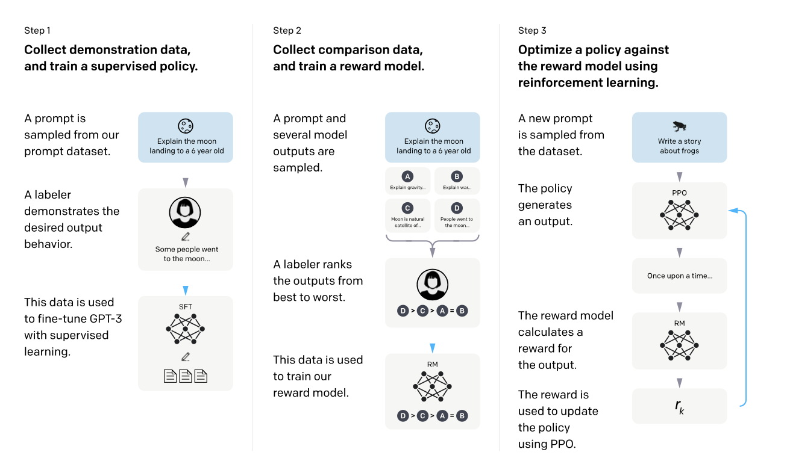

# Abstract

- Bigger models does not directly mean it is useful for users, because pure pretrained language models are not aligned with their users.
- This paper fine tuned a large language model with human feedback, written prompts and labels, then supervised learned it using reinforcement learning.
- Resulted in improvement in truthfulness and less hallucination.
- 1.3B InstructGPT was preferred to 175B GPT-3.

# Introduction

- LLMs can be **prompted**, remind the few shot approach of GPT papers.
- LLMs often generate unintended outputs since it was trained on predicting the next token on a given corpus, not follow user's instructions helpfully and safely, in conclusion, the language modeling objective is misaligned.

- The paper trained language models to act in accordance with user's intentions, including explicit intentions and implicit intentions.
- Three keywords: _helpful_ _harmless_ _honest_

- The paper used RLHF (Reinforcement Learning with Human Feedback) [1] 
<Figure 1> Various methods used as RLHF
- Hired 40 labelers, with the prompts submitted to OpenAI API.
- Next, trained a **Reward Model** to predict which model output is preferred, then used this **RM** as a reward function, maximizing it using Proximal Policy Optimization algorithm

## Result

### Human Preference

- 1.3B InstructGPT > 175B GPT-3 with few shot prompts.
- 71 $\pm$ 4 % than the prompted GPT-3

### Truthfulness

- Tested on Closed-domain QA task
- InstructGPT : 21% Hallucination rate
- GPT-3 : 41% Hallucination rate

### Toxicity

- 25% fewer toxic outputs than GPT-3 when prompted to be respectful on RealToxicityPrompts dataset.
- No significant improvement on Winogender and CrowSPairs datasets.

### Performance regression on public NLP dataset

- During RLHF fine-tuning, model showed performance regression on public NLP dataset benchmark (SQuAD, DROP, HellaSwag, and WMT 2015 French to English translation)
- It is called **alignment tax**
- Reduced the regression by mixing Proximal Policy Optimization updates with updates that increase the log likelihood of the pretraining distribution.

### InstructGPT generalized pretty well outside of the RLHF fine-tuning distribution

- Done pretty well on summarizing code, QA on codes, different languages, even though above data were rare within fine tuning data.
- GPT-3 required more careful prompting.
- Model is able to generalize the notion of "following instructions"

# Related work

## Research on alignment and learning from human feedback

- RLHF used to train simple robots in simulated environments, and games but recently has been applied to fine-tuning language models to conduct tasks.
- The paper's work can be seen as a direct application of RLHF to aligning language models on a broad distribution of language tasks.
- Also, alignment of a LM has also received attention.

## Training language models to follow instructions

- LMs used to be trained on a broad range of public NLP datasets.
- Some references on models trained to follow natural language instructions.
  - Bahdanau, D., Hill, F., Leike, J., Hughes, E., Hosseini, A., Kohli, P., and Grefenstette, E. (2018). Learning to understand goal specifications by modelling reward.
  - Abramson, J., Ahuja, A., Barr, I., Brussee, A., Carnevale, F., Cassin, M., Chhaparia, R., Clark, S., Damoc, B., Dudzik, A., et al. (2020). Imitating interactive intelligence.
  - Zhao, M., Anderson, P., Jain, V., Wang, S., Ku, A., Baldridge, J., and Ie, E. (2021). On the evaluation of vision-and-language navigation instructions.

## Evaluating the harms of language models

- There is a growing field aiming to build benchmark to evaluate the large language model's harms, but this is two sides of the sword since effort to reduce this toxicity also reduce the model's ability on under-represented groups' text. (due to its censorship)
- **Modifying the behavior of language models to mitigate harms**
	1. Fine tuning on a small value-targeted dataset.
	2. Remove documents where LLM has a high conditional likelihood of generating a set researcher-written trigger phrases.
	3. Data filtering, blocking certain words of n-grams, safety specific control tokens.
	4. Word embedding regularization
	5. Data augmentation
	6. ... many else...

# Methods and experimental details

## High-level methodology

***Reference papers***
	- Fine-tuning language models from human preferences
	- Learning to summarize from human feedback
	- GPT series
	- Switch transformers: Scaling to trillion parameter models with simple and efficient sparsity. **Will be read soon!**
	- Scaling language models: Methods, analysis & insights from training gopher. **Will be read soon!**
	- Lamda: Language models for dialog applications. **Will be read soon!** 

***Three steps of training***
	- Supervised learning phase: Collect demonstration data, and train
	- Train a reward model : from comparisons between model outputs based on labeler's preference.
	- Reinforcement learning phase: Using output of trained reward model as a scalar reward, researchers fine tuned the model to follow policy optimizing the reward with PPO algorithm.
	- step 2 & 3 can be repeated continuously. 

## Dataset

- Collected from user API prompt
- Three kinds of prompts
	- **Plain** arbitrary task with sufficient diversity
	- **Few-shot** gpt3 style multiple query/response
	- **User-based** actual user cases
- Three different datasets
	- **SFT** 
	- **RM**
	- **PPO** : RLHF fine tuning

## Models

1. **Supervised fine tuning** 
	- GPT3 with labeler demonstrations supervised.
	- 16 epochs
	- Direct overfitting after 1 epoch, but little help on RM score and human preference ratings
2. **Reward Modeling**
	- Starting with SFT whose final unembedding layers removed, reward model output a scalar reward from a prompt and response. 
	- Only used 6B GPT reward model (175B too large to be stable, not appropriate to be a value function during RL)

# Reference

[1] Christiano, Paul F., et al. "Deep reinforcement learning from human preferences." *Advances in neural information processing systems* 30 (2017).
